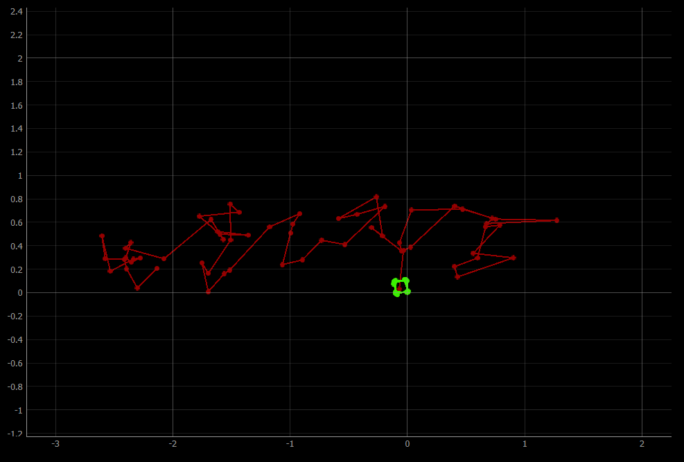
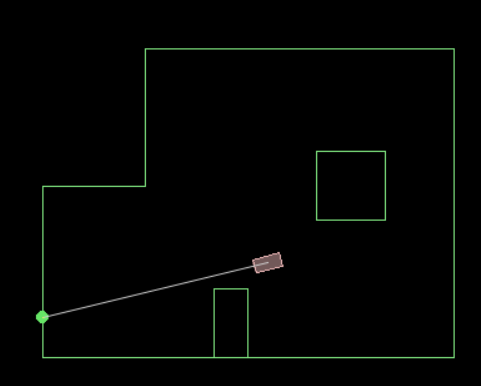
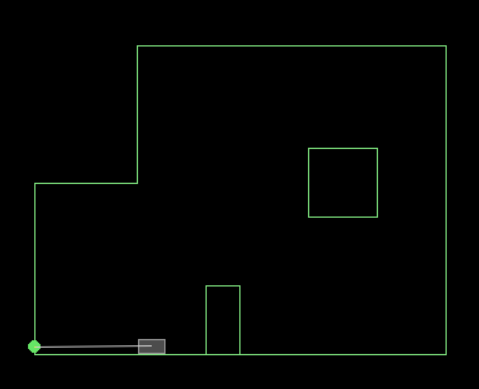

# Lab 10 - Simulator

## Description and Functionalities
The simulator shows a virtual map and a virtual robot. The robot can move throughout the map and be set to various angular and linear speeds. There is a header on the robot with a straight line to wherever a distance sensor on the robot would hit a wall and sense a distance. This is also useful for visually determining the front of the robot.

### CMDR Class
The commander class is used to control the robot programmatically. Some functions I use in this lab include `cmdr.set_vel(linear_vel, angular_vel)`, `cmdr.plotter_is_running()`and `cmdr.sim_is_running()` (to check if the simulator and plotter are running).

### Start/Stop/Reset
The simulator and plotter can be reset using `RESET_SIM()` and `RESET_PLOTTER()` respectively.

They can be started with `START_SIM()` and `START_PLOTTER()`.

They can be stopped by closing the windows or by calling `STOP_SIM()` and/or `STOP_PLOTTER()`.

#### Fun Fact-- it's possible to get the robot stuck (when using manual control only)
Here it is stuck in the corner of the simulator after I played around with it for a while. While it might be theoretically possible to un-stuck it by setting the angular velocity to 0, there is no way to do this reliably with manual control.


## Open Loop Control - Square
The simulator runs differently on different machines because different machines run at different rates due to limitations in hardware and also have a different number of background tasks, which changes how fast or slow the simulator runs. This means that the angular velocity needs to be tuned to each computer, and may not necessary work best at a constant value from day to day.

I found that 88 degree turns actually turn out reasonably close to 90 degree turns in the simulator on my computer today, which is also running 13 Chrome tabs and VS Code, with various other apps not open but running in the background.

It seems like, if given consistent background tasks, the robot will always go in the same shape, but it will look a little different each time as it will always slightly under turn (in my case).

### Ground Truth and Odometry Plot


The odometry (red) is a bit of a mess, and definitely does not depict the robot's motion well. It can determine that a turn occured quite well, but it is very bad at determining what the angle of that turn was. It is also not particularly good at determining the distance the robot travelled. It looks like most of the lines are on the same order of magnitude, but not the same length at all.

The ground truth (green) shows that my robot was in fact going in (almost) square path the whole time.


### Code:
```py
while cmdr.sim_is_running() and cmdr.plotter_is_running():
    pose, gt_pose = cmdr.get_pose()
    cmdr.plot_odom(pose[0], pose[1])
    cmdr.plot_gt(gt_pose[0], gt_pose[1])
    cmdr.set_vel(0,-math.radians(-88))
    await asyncio.sleep(1)
    pose, gt_pose = cmdr.get_pose()
    cmdr.plot_odom(pose[0], pose[1])
    cmdr.plot_gt(gt_pose[0], gt_pose[1])
    cmdr.set_vel(.1, 0)
    pose, gt_pose = cmdr.get_pose()
    cmdr.plot_odom(pose[0], pose[1])
    cmdr.plot_gt(gt_pose[0], gt_pose[1])
    await asyncio.sleep(1)
```

## Closed Loop Control - Wall Avoidance
I found this algorithm to work reasonably well for wall avoidance:

```py
cmdr.set_vel(.5, 0) # set initial velocity

while cmdr.sim_is_running() and cmdr.plotter_is_running():
    sensor_value = cmdr.get_sensor() # check sensor value
    if (sensor_value < .3 ): #if robot is close to a wall
        cmdr.set_vel(0, 90) # turn about 90 degrees
        await asyncio.sleep(1)
        cmdr.set_vel(1, 0) # go forward again
    await asyncio.sleep(.01) # delay slightly before checking sensor again
```
I used a speed of 1 in this case. I thought this speed was a good balance of going fast and avoiding the majority of collisions. The robot can go faster and still avoid some collisions, but at higher speeds, the robot is more likely to collide with things.

I found that the robot can get about .3 meters from the wall before it will collide while turning. Increasing this threshold would lead to more reliable collision avoidance at higher speeds, with the cost of spending more time turning away from walls, as the robot would find itself too close to a wall more often.

### Complete Collision Avoidance (nearly) Impossible
There are some edge cases that my algorithm does not cover, like the one shown below:



Because the sensor is at the center of the robot, but the root has a width, it is possible for the robot to sense past a corner while the robot will actually hit the corner.

This could potentially be avoided by finding all distance ranges where this would be the case, and implementing a smaller turn in these cases, but writing such code would be very complicated and not very likely to work unless the robot was moving slowly enough that multiple correcting turns could occur before a collision.

My alorithm also does not work well in cases where the angle between the heading on the robot and a wall is very small. In these cases, the robot thinks it is farther than it is from the wall than it actually is. There is not much that could be done in the simulator to avoid this, as it will probably always happen at some point in any algorithm due to random chance. However, on a real robot, the TOF sensor on the side could be used to detect this situation.

It is also possible, in some edge cases, for the robot to get stuck in this algorithm as well:
