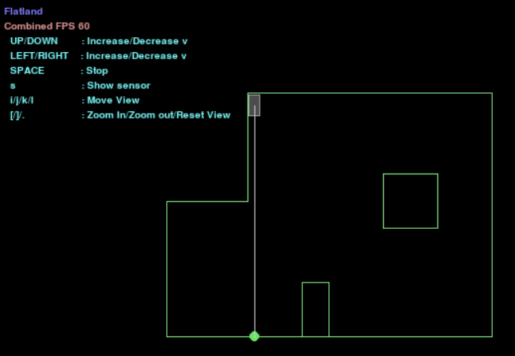

# Lab 10 - Simulator

## Description and Functionalities
The simulator shows a virtual map and a virtual robot. The robot can move throughout the map and be set to various angular and linear speeds. There is a header on the robot with a straight line to wherever a distance sensor on the robot would hit a wall and sense a distance. This is also useful for visually determining the front of the robot.

#### Fun Fact-- it's possible to get the robot stuck (when using manual control only)
Here it is stuck in the corner of the simulator after I played around with it for a while. While it might be theoretically possible to un-stuck it by setting the angular velocity to 0, there is no way to do this reliably with manual control.



## Open Loop Control - Square
The simulator runs differently on different machines because different machines run at different rates due to limitations in hardware and also have a different number of background tasks, which changes how fast or slow the simulator runs.

```py
cmdr.set_vel(0,-math.radians(-86.5))
await asyncio.sleep(1)
cmdr.set_vel(x, 0)
await asyncio.sleep(1)
```

## Closed Loop Control - Wall Avoidance