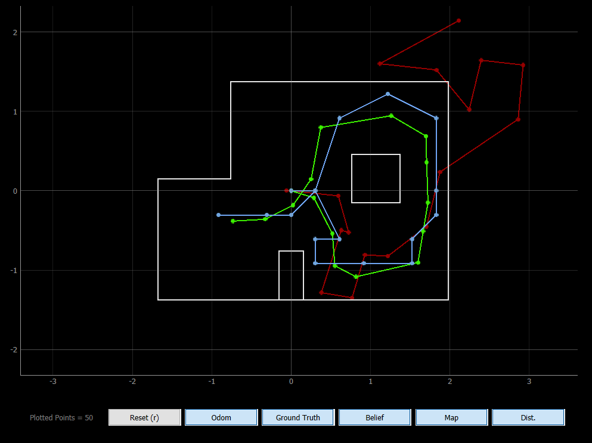
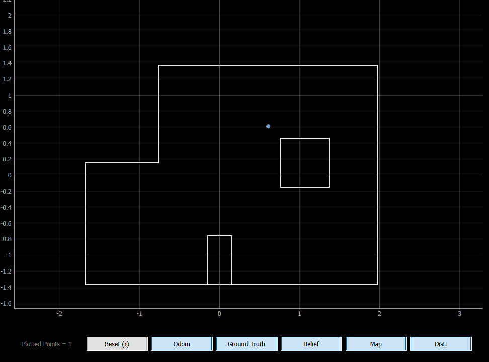
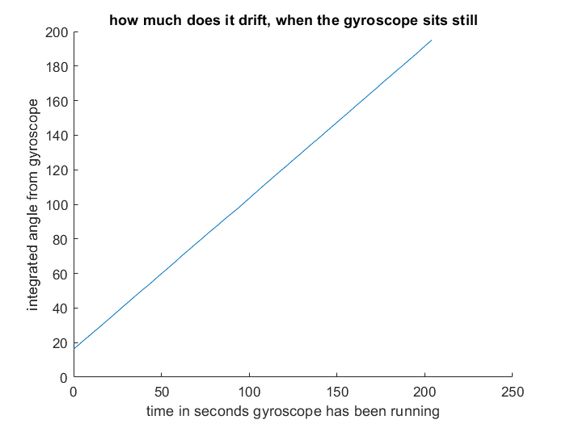

# Lab 12 - Localization

## The simulation works :)
Running the provided code, I can determine that the simulation works well.



You can see that it works in some areas better than others. There are always

The map is more symmetrical near the top, which makes it harder for the Bayes filter to determine where the robot is accurately.

## Implementing on the Artemis

## Implementing in Python
```py
async def perform_observation_loop(self, rot_vel=120):
        """Perform the observation loop behavior on the real robot, where the robot does  
        a 360 degree turn in place while collecting equidistant (in the angular space) sensor
        readings, with the first sensor reading taken at the robot's current heading. 
        The number of sensor readings depends on "observations_count"(=18) defined in world.yaml.
        
        Keyword arguments:
            rot_vel -- (Optional) Angular Velocity for loop (degrees/second)
                        Do not remove this parameter from the function definition, even if you don't use it.
        Returns:
            sensor_ranges   -- A column numpy array of the range values (meters)
            sensor_bearings -- A column numpy array of the bearings at which the sensor readings were taken (degrees)
                               The bearing values are not used in the Localization module, so you may return a empty numpy array
        """
        ble.start_notify(ble.uuid['RX_FLOAT'], self.notification_handler_float) # start the notification handler for data transmission for floats
        ble.start_notify(ble.uuid['RX_STRING'], self.notification_handler_string) # start the notification handler for data transmission for strings
        # i'm not actually using strings. i'm just going to cast it directly back to a float in python
        # i'm doing the two transmission channels to keep things seperate so that no confusion between a sensor range and sensor bearing can occur
        while(len(robot.sensor_bearings) < 18): #while we have less than 18 measuments (measurements per turn)
            ble.send_command(CMD.PING, "") # get the robot to perform one small turn
            a = len(robot.sensor_bearings) # see how many measurements exist currently
            b = 0 # initialize a variable that will always be less than a + 1
            while(b < a + 1): # while we are waiting for a new measurement
                b = len(robot.sensor_bearings) # update variable
                await asyncio.sleep(.1) # wait
        ble.send_command(CMD.STOPSPIN, "") # stop spinning
        return self.sensor_ranges, self.sensor_bearings # return data
```

## Results

Not going to lie, this lab was not it for my robot :/

See the [appendix](https://lmnawrocki.github.io/lab12/#appendix---blame-distribution) for the blame distribution, but I will discuss the blame I place on motor dynamics, the floor, and gyroscope problems and how they contributed to my robot being unable to localize properly.

The floor & wheel dynamics: Sometimes there are inconsistencies in that my wheels are dirty and sticky and so is the floor. These things are dirty and sticky in various places, which can lead to a little bit of inconsistant movement. If I knew a good way to clean my wheels (other than *literally* giving my robot a bath), I would. I'm also not super interested in cleaning the floor. While the floor is not the cleanest, I don't think it's contributing that much to my robot slipping on the floor.

My *motor* dynamics are actually pretty consistent; my motors are turning in the way they should for the car to move the way it should. They start & stop the movement very quickly and consistently using active braking.

But the real source of error is the gyroscope.

I put some effort into [accounting for the drift](https://lmnawrocki.github.io/lab12/#appendix---accounting-for-gyro-drift) that occurs over time, and despite this, the gyrocope is still always very off. It will consistently think that my robot only turned 250-280 degrees in total despite the actual robot doing a consistent 1.5+ rotations.

Here's a [video](https://photos.app.goo.gl/EEXYEdHnanZCLr9ZA) of it (not) working :)

The gyroscope thinks it turned 277 degrees but as you can see it simply did not.

Here's a [second video](https://photos.app.goo.gl/LFeniJeJYmwCyUyk8) where the gyroscope thinks it turned 257 degrees and while it sure did turn less than the other video, it sure did not turn 257 degrees. No, it did not localize properly here either.


### It Localizes, but Wrong :/

The robot was in the location shown in the first video during this localization :/

### how, perhaps, this could be fixed
Adjust the number of measurements so that the robot actually turns 360 degrees, despite whatever alternative reality the gyroscope is in. Assume the gyroscope was consistently off, and normalize the angles it found to a 360-degree rotation.

cross fingers.

##### appendix - accounting for gyro drift
here is this graph to show that it drifts 0.9516 deg/second, the slope of this line. The robot was sitting still on a flat table during this test.


##### appendix - blame distribution
blame is distributed as follows:

| Item to blame      | % of blame |
| ----------- | ----------- |
| wheel dynamics     | 15% |
| the floor          | 5%  |
| my mental health~~ | 40% |
| gyroscope problems | 40% |

<sub>(please don't worry about the mental health it's a perfectly normal reaction to nine silly people in silly robes plotting your disappearance & will poke you w/ a little stick if you don't go away)<sub>

(this is supposed to be humor)