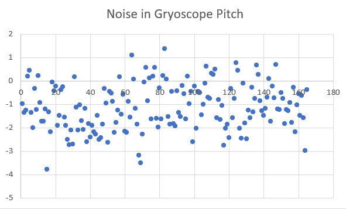

## Lab 3 Sensors

# Soldering stuff
## Why You should use shutdown pins
Using shutdown pins will make it more clear in my code which TOF sensor the code is "talking" to at any point in time.

I am not the best at CS and it will be easier for me to understand what is happening when the sensor not in use is completely shut off. I also enjoyed getting the extra solding practice.

Also, I'm too lazy to think of a new address for the second TOF sensor, and this is a great way to avoid that.

(There's no way that's better than the other, really. Both ways work. Except my way is obviously better.)

## Wire up TOF
Wire yellow to SCL.
Wire blue to SDA.
Wire black to ground.
Wire red to VDD.

I used pin 4 and 8 and green wires to connect the shutdown pins. (XSHUT on the TOF sensor.)

## Wire up IMU
Wire yellow to SCL.
Wire blue to SDA.
Wire black to ground.
Wire red to 2-6V.

## some soldering stuff I learned
Soldering is very hard. The wires in this project are made up of a bunch of smaller wires. 
1. after stripping a wire, twist the end together to make it stronger
2. put a little bit of solder on the twisted wire. You don't need enough to make the wire noticibly thicker, just get it in between the threads and ideally down inside the coating.
3. CLEAN YOUR SOLDERING IRON! This may require tin and/or a wet sponge.
4. You can undo solder with suction or with a special kind of copper wire.

# 3a
1. When you just have one TOF, it prints one address. When you have two TOFs connected, it prints *every* address. This is not exactly what I expected, however, the TAs have confirmed this is normal behavior.

2. Setting the distance mode changes the maximum distnce the TOF can read. Longer distance modes can be less accurate, though.

I think that on the final robot, since it is so fast, it might be best to use the 1.3m mode since that can potentially tell the robot most accurately when it is about to hit a wall. I don't think it's as important for the robot to know how far away it is from far away things, but I could be wrong.

# 3b
AD0_VAL is the value of the last bit of the I2C address. It should be 0 in our case.

As I move the IMU around, the sensor values will change based on which way I turn or move the IMU.
\
The accelerometer is much more accurate than the gyroscope.
\
The gyroscope has drift, which is where the sensor value will slowly increase even when the sensor is just sitting on the table, not moving.
\

Here is some data:
```
Scaled. Acc (mg) [ -00734.86, -00912.11, -00645.51 ], Gyr (DPS) [  00016.77, -00146.07, -00048.37 ], Mag (uT) [  00561.30, -00585.45, -00283.95 ], Tmp (C) [  00025.59 ]
Scaled. Acc (mg) [ -00703.61, -00887.21, -00565.92 ], Gyr (DPS) [  00009.44, -00139.88, -00031.73 ], Mag (uT) [  00562.20, -00585.60, -00281.55 ], Tmp (C) [  00025.54 ]
Scaled. Acc (mg) [ -00734.86, -00746.09, -00453.12 ], Gyr (DPS) [ -00002.41, -00143.31, -00022.56 ], Mag (uT) [  00566.10, -00584.10, -00277.65 ], Tmp (C) [  00025.35 ]
Scaled. Acc (mg) [ -00779.30, -00588.87, -00235.35 ], Gyr (DPS) [ -00009.67, -00123.53, -00033.34 ], Mag (uT) [  00566.25, -00584.70, -00277.50 ], Tmp (C) [  00025.73 ]
Scaled. Acc (mg) [ -00902.83, -00392.09, -00160.64 ], Gyr (DPS) [ -00007.06, -00104.19, -00036.73 ], Mag (uT) [  00568.65, -00584.25, -00275.70 ], Tmp (C) [  00025.35 ]
Scaled. Acc (mg) [ -01007.81, -00111.82, -00079.59 ], Gyr (DPS) [ -00005.43, -00092.97, -00039.32 ], Mag (uT) [  00568.65, -00584.25, -00273.30 ], Tmp (C) [  00025.68 ]
Scaled. Acc (mg) [ -01111.33,  00198.73, -00065.92 ], Gyr (DPS) [  00003.62, -00077.14, -00037.43 ], Mag (uT) [  00569.70, -00588.75, -00272.55 ], Tmp (C) [  00025.54 ]
Scaled. Acc (mg) [ -01050.29,  00499.51, -00028.81 ], Gyr (DPS) [  00000.41, -00048.21, -00042.21 ], Mag (uT) [  00570.15, -00592.35, -00271.05 ], Tmp (C) [  00025.25 ]
Scaled. Acc (mg) [ -01051.27,  00811.04,  00015.63 ], Gyr (DPS) [  00007.08, -00042.10, -00052.06 ], Mag (uT) [  00570.90, -00592.35, -00271.05 ], Tmp (C) [  00025.68 ]
Scaled. Acc (mg) [ -01288.57,  00850.59,  00035.64 ], Gyr (DPS) [  00018.86, -00054.92, -00055.77 ], Mag (uT) [  00571.05, -00593.70, -00271.20 ], Tmp (C) [  00025.68 ]
Scaled. Acc (mg) [ -01304.69,  00817.38,  00060.55 ], Gyr (DPS) [  00044.92, -00072.53, -00049.43 ], Mag (uT) [  00570.90, -00593.10, -00267.90 ], Tmp (C) [  00025.44 ]
Scaled. Acc (mg) [ -01333.01,  00739.75, -00062.01 ], Gyr (DPS) [  00066.53, -00103.40, -00043.95 ], Mag (uT) [  00571.50, -00593.70, -00267.00 ], Tmp (C) [  00025.44 ]
Scaled. Acc (mg) [ -01185.55,  00501.95, -00171.39 ], Gyr (DPS) [  00074.62, -00127.75, -00026.43 ], Mag (uT) [  00570.75, -00594.15, -00265.50 ], Tmp (C) [  00025.39 ]
Scaled. Acc (mg) [ -00904.79,  00410.64, -00198.24 ], Gyr (DPS) [  00087.24, -00133.30, -00023.61 ], Mag (uT) [  00571.35, -00593.55, -00264.90 ], Tmp (C) [  00025.44 ]
Scaled. Acc (mg) [ -00864.26,  00022.95, -00360.35 ], Gyr (DPS) [  00075.86, -00147.69, -00046.84 ], Mag (uT) [  00571.05, -00593.70, -00263.85 ], Tmp (C) [  00025.59 ]
Scaled. Acc (mg) [ -00997.07, -00249.02, -00431.15 ], Gyr (DPS) [  00062.64, -00171.89, -00056.73 ], Mag (uT) [  00572.25, -00593.40, -00263.55 ], Tmp (C) [  00025.54 ]
Scaled. Acc (mg) [ -01083.50, -00549.80, -00428.71 ], Gyr (DPS) [  00037.72, -00173.44, -00061.13 ], Mag (uT) [  00570.90, -00594.30, -00262.50 ], Tmp (C) [  00025.59 ]
Scaled. Acc (mg) [ -01082.52, -00731.45, -00437.50 ], Gyr (DPS) [  00018.04, -00185.36, -00043.52 ], Mag (uT) [  00570.30, -00593.40, -00261.30 ], Tmp (C) [  00025.44 ]
Scaled. Acc (mg) [ -00942.38, -01063.48, -00308.59 ], Gyr (DPS) [ -00014.47, -00189.81, -00016.21 ], Mag (uT) [  00570.30, -00593.40, -00261.30 ], Tmp (C) [  00025.59 ]
Scaled. Acc (mg) [ -00750.49, -01244.14, -00114.75 ], Gyr (DPS) [ -00033.77, -00175.75,  00004.14 ], Mag (uT) [  00570.75, -00595.35, -00255.45 ], Tmp (C) [  00025.54 ]
Scaled. Acc (mg) [ -00647.46, -01153.81,  00006.84 ], Gyr (DPS) [ -00042.37, -00139.84,  00004.36 ], Mag (uT) [  00570.30, -00591.75, -00252.00 ], Tmp (C) [  00025.59 ]
Scaled. Acc (mg) [ -00634.28, -00888.67,  00184.57 ], Gyr (DPS) [ -00042.04, -00113.56, -00002.13 ], Mag (uT) [  00569.40, -00591.90, -00250.35 ], Tmp (C) [  00025.39 ]
Scaled. Acc (mg) [ -00530.76, -00684.08,  00426.76 ], Gyr (DPS) [ -00036.86, -00092.77, -00006.30 ], Mag (uT) [  00570.75, -00593.70, -00247.05 ], Tmp (C) [  00025.68 ]
Scaled. Acc (mg) [ -00473.63, -00442.38,  00588.87 ], Gyr (DPS) [ -00023.33, -00053.15, -00010.24 ], Mag (uT) [  00571.05, -00592.05, -00245.25 ], Tmp (C) [  00025.54 ]
```


\
In this graph, you can see the drift that occurs in 

Because these values are negative on average, the integration of them will gradually accumulate more and more error.

## Accelerometer


## Code Citations:
I used the Feb. 3 lecture slides for code for the complementary filter.