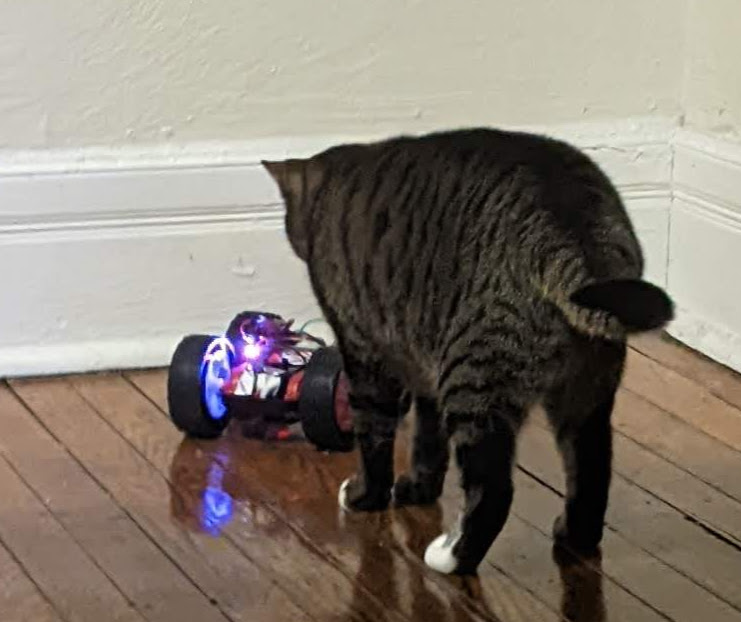
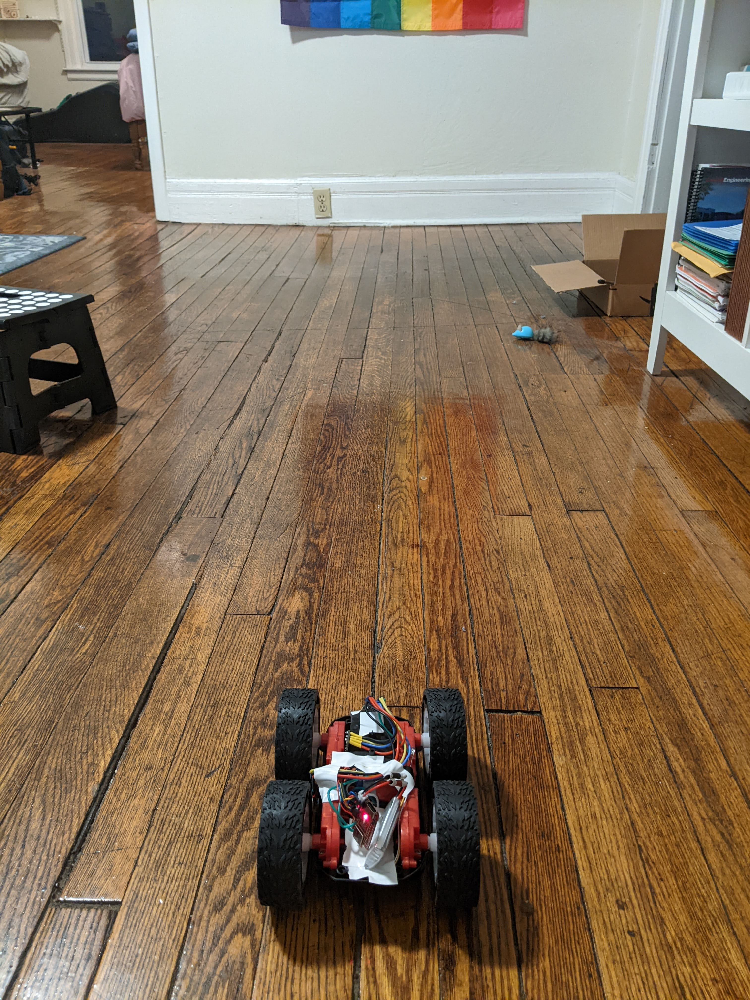
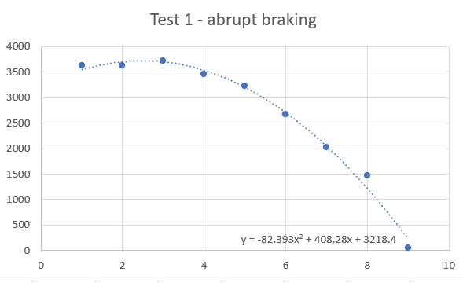
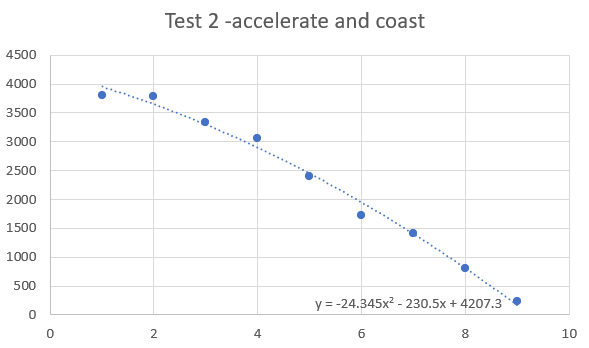
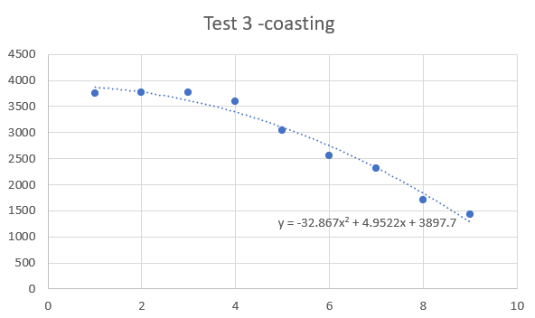
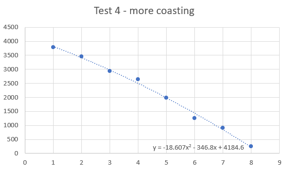
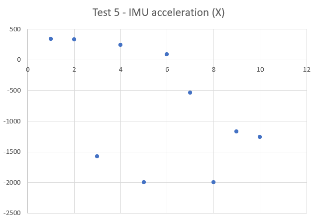

## Lab 4 Characterize Your Car

# Part A
### Table 1 - Measurements

Description                 | Measurement (cm)
----------------------------|------------------
Diameter of wheels          | 8
Diameter of wheels (1)      | 6.8
Thickness of wheels         | 2.8
Battery compartment length  | 5.5
Battery compartment width   | 3
Battery compartment height  | 2.7
Length of body              | 15
Width of body               | 7.5
Distance between front and back wheels | 10
Distance between left and right wheels (2) | 8.9

(1) Under deformation by the pressure of my fingers
(2) measured from the inside of the wheels closest to the car

### Table 2 - Screws
Type of Screws                              | Number of Such Type
--------------------------------------------|--------------------
Screws to hold two halves together          | 4
Screws holding gearbox frame to outer shell | 8
Screws on the circuit board                 | 2
Screws holding battery compartment cover on | 1
Number of screws to worry about losing      | 14

### Stationary Observation 3 - Cat
She is mildly interested in the car. Thankfully she has not yet become too interested while it is moving.
***fingers crossed***



# Part B -- "Non Destructive" Testing
I am clumsy sometimes. My robot is very fast. I am not the best driver. There may or may not have been some wires broken. Thus, I was only able to get so much data with the TOF sensor. I almost got data with roll in spinning the robot with the IMU, but I broke the wire before I could test it. I did get some acceleration IMU data.
\
I also had some issues with the battery powering the Artemis not doing a great job of staying plugged in. I think this could be resolved with some strategically placed tape, but I do not think tape should be a permanent solution. Something needs to pinch the wires from the battery into the white connector and hold them in place. I may want to consider a 3D printed part or adjusting the white connector.
\
The test setup: Hardwood floors in my apartment:


Here is the code I used to get data from the TOF sensors on the Artemis:
```
void
write_data()
{   
    distanceSensor1.startRanging(); //Write configuration bytes to initiate measurement
    while (!distanceSensor1.checkForDataReady())
    {
      delay(1);
    }
    
    int distance = distanceSensor1.getDistance(); //Get the result of the measurement from the sensor
    distanceSensor1.clearInterrupt();
    tx_float_value = (float) distance;

    tx_characteristic_float.writeValue(tx_float_value);
}
```

Here is the code for getting IMU data:
```
void
write_data()
{   
    if (myICM.dataReady())
    {
      myICM.getAGMT();
      //Serial.println(myICM.accY());
      float roll = atan(myICM.accY()/myICM.accZ())*180/3.14159;
      tx_float_value = roll;
      tx_characteristic_float.writeValue(tx_float_value);
    }

}
```

Here is the Python code for receiving the data:
```
i = 0
print(i)
while i <500:
    f = ble.receive_float(ble.uuid['RX_FLOAT'])
    print(f)
    i = i +1
```

## Testing Graphs




