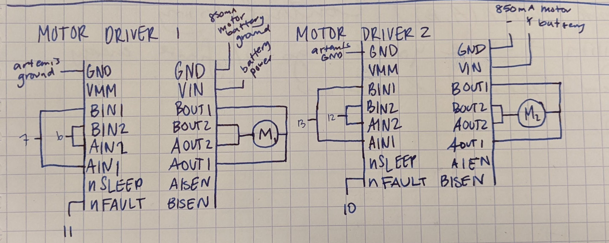
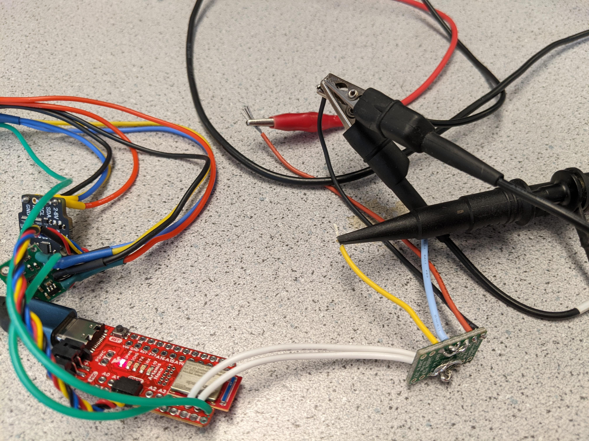
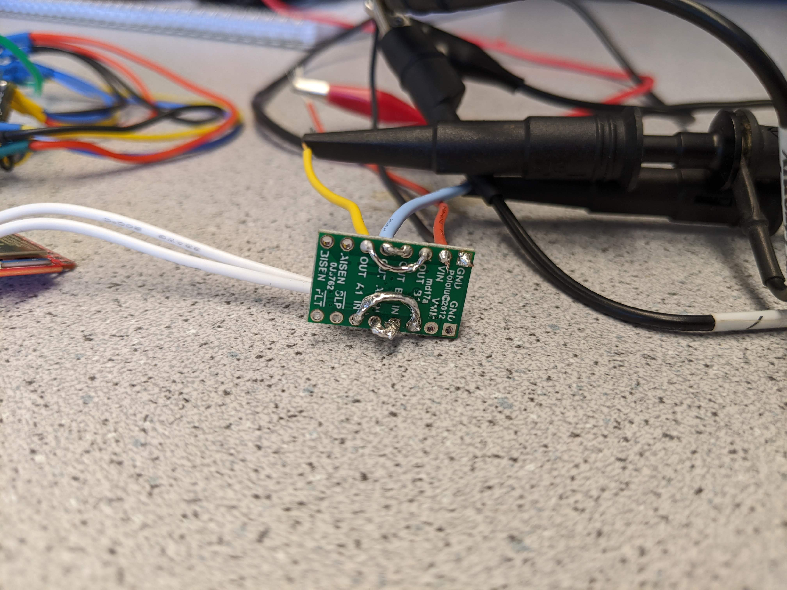
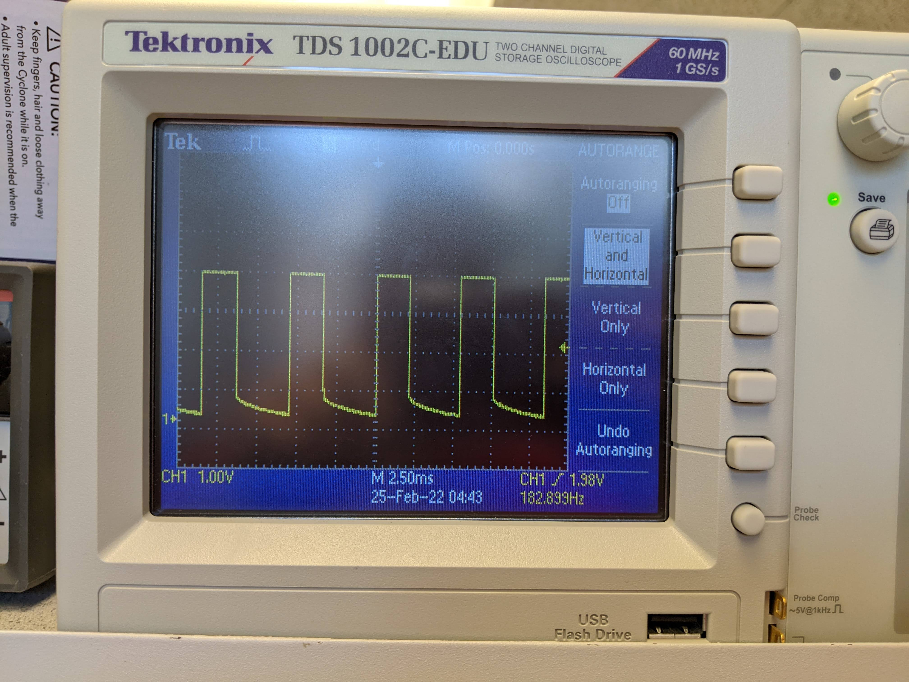
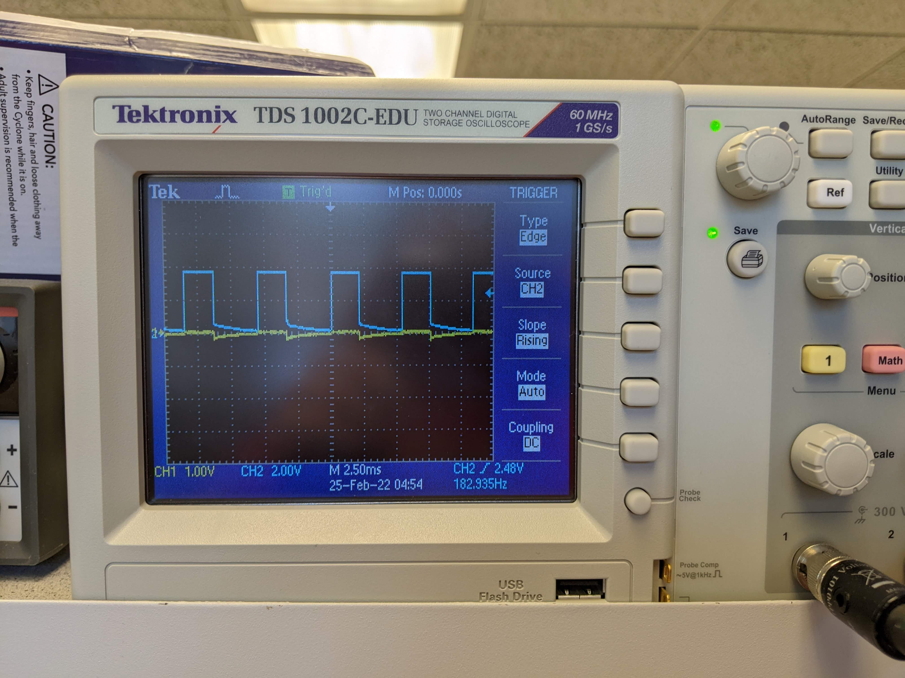
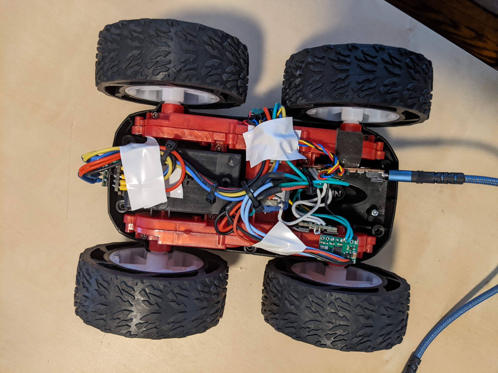

# Lab 5
## Pre-Lab:

Circuit diagram:



The Artemis and the motors should be powered seperately because the motors use WAY more current than the Artemis. I would probably (almost definitely) fry the Artemis if I tried to connect them to the same connection. Or I would have a VERY slow robot.

I will be using pins 6,7,12, and 13 for motor control on the Artemis.

I intend to measure out how long wires need to be by situating them over the car before I begin any soldering.

## Procedure
 1. 
 The reasonable settings for the power supply might be putting in 3.7 V (same as battery power) and allowing up to 5A of current to be drawn from the power supply.

 The motors draw a lot of current, particularly when running at full speed.

 2. 
 Code:

 ```
 void setup() {
  // put your setup code here, to run once:
  pinMode(6, OUTPUT);
  pinMode(7, OUTPUT);
  pinMode(12, OUTPUT);
  pinMode(13, OUTPUT);

}

int speed1 = 45;
int delaytime = 500;

void loop() {
  // SIDE 1 - direction 1
  analogWrite(6, speed1); //forward
}
 ```
 or use this loop function to get the second oscilliscope output:
 ```
 void loop() {
  // SIDE 1 - direction 2
  analogWrite(7, speed1); //forward
}
 ```
Unfortunately, I only ran the motor at one speed in each direction while connected to the oscilliscope. However, you can see that I can vary the speed in my open loop control, where I have the motors turn the car very fast and then move forward and backward less fast.

Below are some photos of how I set up the power supply and the probes and what the oscilliscope outputs looked like when I switched which pin I wrote the PWM to.





 3. Completed wiring:


 4, 5, & 6.
 Code:
 ```
 void setup() {
  // put your setup code here, to run once:
  pinMode(6, OUTPUT);
  pinMode(7, OUTPUT);
  pinMode(12, OUTPUT);
  pinMode(13, OUTPUT);

}

int speed1 = 45;

int delaytime = 500;

void loop() {
  // SIDE 1 - direction 1
  analogWrite(6, speed1); //forward
  delay(delaytime);
  analogWrite(6, 0); // stop motor
  delay(delaytime);
  // SIDE 1 - direction 2
  analogWrite(7, speed1);
  delay(delaytime);
  analogWrite(7, 0); // stop motor
  delay(delaytime);

  // SIDE 2 - direction 1
  analogWrite(13, speed1); //forward
  delay(delaytime);
  analogWrite(13, 0); // stop motor
  delay(delaytime);
  // SIDE 2 - direction 2
  analogWrite(12, speed1);
  delay(delaytime);
  analogWrite(12, 0); // stop motor
  delay(10000000000000000);
}
```
[Motors Function in All Directions -- Video](https://drive.google.com/drive/u/0/folders/11GfFDY5akuKIYUHEsXp0bvGrKUy-pq9A)

7. 

```
void setup() {
  // put your setup code here, to run once:
  pinMode(6, OUTPUT);
  pinMode(7, OUTPUT);
  pinMode(12, OUTPUT);
  pinMode(13, OUTPUT);

}

int speed1 = 30;
int speed2 = 32;
int speed3 = 34;
int speed4 = 36;

int delaytime = 4000;

void loop() {
  analogWrite(6, 34); //forward
  analogWrite(13, 33); //forward
  delay(delaytime);
  
  analogWrite(6, 0); // stop motor
  analogWrite(13, 0); // stop motor
  delay(500);

  analogWrite(6, 33); //forward
  analogWrite(13, 32); //forward
  delay(delaytime);

  analogWrite(6, 0); // stop motor
  analogWrite(13, 0); // stop motor
  delay(500);

  analogWrite(6, 32); //forward
  analogWrite(13, 31); //forward
  delay(delaytime);

  analogWrite(6, 0); // stop motor
  analogWrite(13, 0); // stop motor
  delay(500);
  

  analogWrite(6, 0); // stop motor
  analogWrite(13, 0); // stop motor
  delay(10000000000000000);
}
```

[Slow Movement Video](https://drive.google.com/file/d/1w_lNlxlzIldLpLUuWOJK8-VtY2pBy6-H/view?usp=sharing)

Looking at where my robot was in the code while it was moving, the lower limit of when the motors move it seems to be around a speed 33-34.


Straight line loop code:
```
void setup() {
  // put your setup code here, to run once:
  pinMode(6, OUTPUT);
  pinMode(7, OUTPUT);
  pinMode(12, OUTPUT);
  pinMode(13, OUTPUT);

}
int delaytime = 10000;

void loop() {
  analogWrite(6, 34); //forward
  analogWrite(13, 38); //forward
  delay(delaytime);
  
  analogWrite(6, 0); // stop motor
  analogWrite(13, 0); // stop motor
  delay(10000000000000000);
}
```
[Straight line video](https://drive.google.com/file/d/1UYnsVOr3VtYZBqa70O0fjb5N4gTJFWVK/view?usp=sharing)

In the process of getting this to work, I noticed that there is a slight imbalance in the power output of my motors, therefore I move the one on pin 13 a little bit faster to get the robot to move straighter.

It is notable that this relationship is nonlinear with the power input to the motors. I may need to use a different ratio/difference in input at different speeds.


OL Code:
```
void setup() {
  // put your setup code here, to run once:
  pinMode(6, OUTPUT);
  pinMode(7, OUTPUT);
  pinMode(12, OUTPUT);
  pinMode(13, OUTPUT);

}

int delaytime = 1000;

void loop() {
  analogWrite(6, 255); //spin one way
  analogWrite(12, 255); 
  delay(delaytime);

  stopMotors();
  delay(500);

  analogWrite(13, 255); //spin other way
  analogWrite(7, 255);
  delay(delaytime);
  
  stopMotors();
  delay(500);

  analogWrite(13, 100); // forward
  analogWrite(6, 100);
  delay(500);
  
  stopMotors();
  delay(500);

  analogWrite(12, 100); // forward
  analogWrite(7, 100);
  delay(500);
  

  stopMotors();
  delay(500);
  
  delay(10000000000000000);
}

void stopMotors() {
  analogWrite(6, 0); // stop motor
  analogWrite(13, 0); // stop motor
  analogWrite(7, 0);
  analogWrite(12, 0);
}
```

[OL Video](https://drive.google.com/file/d/15FEwElfQOallrpd0WPFaxG314KCApNN8/view?usp=sharing)