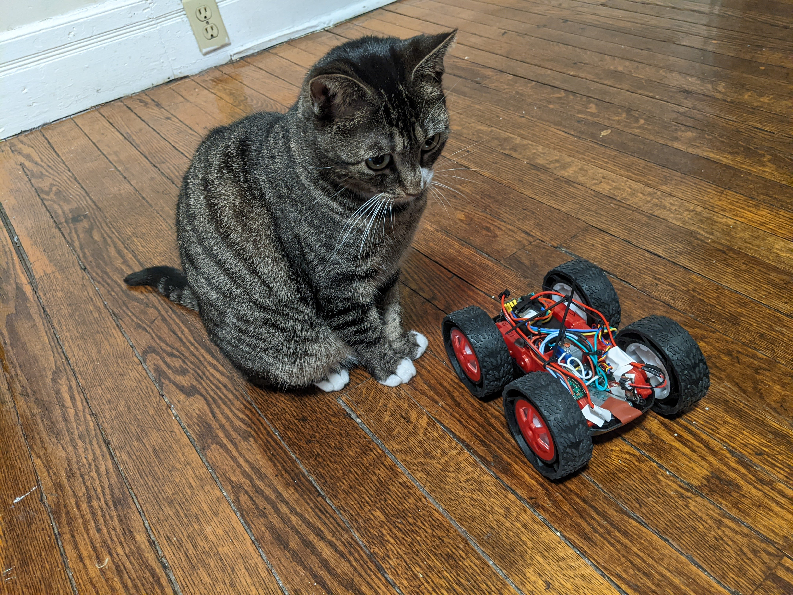

# Lab 6 - P "ID" Control
## Task A: Don’t Hit the Wall!!

## Why Proportional?
My TOF sensor is not very accurate when my robot is moving fast.

Furthermore, the slowness of the TOF sensor makes the integral and derivative terms of the PID controller less useful.

When the sensor is slow, the dt value for caculating the integral and derivative terms can make those terms prone to linearization errors, as slow sensors mean large dt values.

These integrator and derivative are most useful when dt is very small.

Additionally, the derivitave term is subject to derivative kick, particularly when I use the e-stop function I built in when something is very close to the front TOF sensor, and the integral term is subject to integrator wind-up, which can cause my car to want to overshoot and consistently hit the wall, and I don't need to break any more TOF sensors.

## Implementing PID Control
To see the global variable declarations, look at the Appendix at the bottom of this page.
All of the code in this section is in a function:
```
void proportionalControl(){}
```
which is called while Bluetooth is connected in:
```
while (central.connected()) {
            readDistance();
            proportionalControl();
        }
```
after another function reads the current value of the TOF sensor on the front of the robot. (See lab 3 for details on TOF)
### Proportional Control
```
err[iter] = distance1 - totalDist;
P = Kp*err[iter];
```
### Integral Control
I found that the integrator wind-up and high error made using an integrator impractical in this lab, even with very small KI values.
But here is the code you need to hypothetically implement an integrator. Initialize `integrator` at 0.
```
starttime = millis();
dt = (starttime - endtime)*.001;
integral = integral + err[iter]*dt;
I = KI * integral;
```
Endtime and starttime are initialized at zero, and endtime is the time using `millis()` after the motor values have been assigned at the end of the PID loop.

### Derivative Control
Here is hypothetically how you can implement a derivative aspect to PID control. I did not use this because the derivative kick made my robot go quite slowly. You can see a video of that here [Derivative Kick -- Video](https://photos.app.goo.gl/ow7LNoEkMuqRZndW8). The robot struggles to speed up at the begginning as a result of the derivative term. Please ignore that the robot does not meet and stay at the target distance in this video--I get it working later.

```
if (iter >2){
    derivative = (err[iter-1] - err[iter])/(dt);
  }
  else {
    derivative = 0;
  }
D =  KD * derivative;
```
The KD value used in the video above was .05, but as you can see, it still had a big effect in slowing the robot down in the beggining.
### Putting PID Control Together & Controlling the Motors Accordingly
```
PID = P + I + D;

// default case--writes all motor values to zero. Some will get over-written later with non-zero values.
analogWrite(7,0);
analogWrite(12,0);
analogWrite(6,0);
analogWrite(13,0);
  

if (PID > 1) {
    analogWrite(13, PID); // forward
    analogWrite(6, PID);
  }
  
// if it's not positive--must need to go backwards
// flip the sign of the value to avoid writing negative
// values to the pins
PID = -PID;
  

if (PID > 1) {
    analogWrite(12, PID); // backward
    analogWrite(7, PID);
}

//get the end time and increase the iteration number, for the integral and derivative terms
endtime = millis();
iter = iter + 1;
```

## Sensor Sampling Rate
I found that my TOF sensor is able to get data every 92-110ms, with an average time of around 100ms.

## "Hacks" to make the system work & Dealing with Deadband
### Hack 1 -- Meh, Close Enough
I decided that having +/- 1cm of error was acceptable in this lab. Therefore, if the TOF sensor is reading a value in between 290 and 310mm, the robot will actively brake by writing a high PWM signal to all motor pins.
```
  if (distance1 < 310){
    if (distance1 > 290) {
      analogWrite(6, 255);
      analogWrite(13, 255);
      analogWrite(7, 255);
      analogWrite(12, 255);
    }
  }
```
### Hack 2 -- Upper and Lower Limits on PID values
The following code will make sure your PID value is between 42 and 100.
I used 42 as a value for the deadband of my motors because low battery power can increase this value a little bit.
I used 100 as an upper value because I found that my robot went a little too fast and hit the wall too often without this upper limit, which I preferred to avoid especially after breaking a TOF sensor. The robot would still reach the setpoint without this upper limit, though.
```
if (PID > 100){
    PID = 100;
  }
if (PID > 1) {
    if (PID < 42) {
      PID = 42;
    }
  }
```

### Hack 3 -- E-stop
```
// an e-stop for when I put my hand in front of the TOF sensor, to save my sanity
if (distance1 < 50){
    PID = 0; // to avoid writing a value that would move the robot in another part of this loop iteration
    analogWrite(13, 255);
    analogWrite(6, 255);
    analogWrite(12, 255);
    analogWrite(7, 255);
  }
```
This e-stop uses active breaking, but it would also be reasonably effective if the PWM value was 0, and the motors would coast to a stop.

## Sending Data Over Bluetooth
### Bluetooth Transmission Setup
Later on in the PID loop after all the hacks and incrementing the iteration number, I transmit the time and distance values for that iteration.
```
  if (n < 20){
    distance_values[n] = distance1;
    timestamp_values[n] = endtime;
    n = n + 1;
  }
  if (n == 20){
    transmitTime();
    delay(15);
    transmitDistance();
    n = 0;
  }
```
These functions only transmit 20 values at a time. I could be more efficient by deleting the spaces after each comma and upping the max message size to 200 characters to send closet to 30 values per string, but I wanted the data to be readable in Jupyter Lab.
It is noteworthy that this code can break if the values are enough digits such that the string built is over 150 characters (or the current max message size) and then the values will not be sent properly. 

### Using String Builders
This function puts the timestamp values into the characteristic string.
```
void transmitTime(){
  int i;
  tx_estring_value.clear();
  for (i=0; i<20; i = i +1){
    
    tx_estring_value.append(timestamp_values[i]);
    tx_estring_value.append(", ");
  }
  tx_characteristic_string.writeValue(tx_estring_value.c_str());
}
```
This function puts the TOF values into a different string for sending TOF values. I consider creating this BLECStringCharacteristic and the setup needed outside of this function to be within the scope of Lab 2.
```
void transmitDistance(){
  int i;
  tx_estring_value.clear();
  for (i=0; i<20; i = i +1){
    
    tx_estring_value.append(distance_values[i]);
    tx_estring_value.append(", ");
  }
  tx_tof1.writeValue(tx_estring_value.c_str());
}
```
### Receiving Over Bluetooth
Use a notification handler funtion as in Lab 2 and print the values:
```
ble.start_notify(ble.uuid['RX_STRING'], notification_handler_string) # for PID values
ble.start_notify(ble.uuid['RX_TOF1'], notification_handler_tof1) # for distance values

while True:
    await asyncio.sleep(1)
    print('timestamp vales')
    print(string_value)
    print('tof1 values')
    print(tof1_value)
```

## Videos of the System Working
### Video 1
[From far away, in lab](https://photos.app.goo.gl/g8FpMASzkHMbjMYt6)
### Video 2
[closer to the wall, also in lab](https://photos.app.goo.gl/vV6DF7zjYABzhZE59)
### Video 3
[at home -- still works :)](https://photos.app.goo.gl/QN4kwuHayH9UhhT69)

## Logged Data & Max Speed Acheived
From my data logging, I was able to find that the max speed was xxx.
## Appendix -- Global Variable Declarations
Here is the code I used to declare all the global variables that I used in this lab.
```
int totalDist = 300;
int distance1 = 0;
float Kp = 0.1;
float KI = 0.05;
float KD = 0.05;

int n = 0;
int PID_values[100];
int distance_values[100];
int timestamp_values[100];

int err[1003];
int iter = 0;
int integral = 0;
int derivative = 0;
int endtime = 0;
int starttime;
float dt;
float PID;
float P;
float I;
float D;
```
## Appendix -- Paying My Cat Tax
Somehow, my robot got through this lab safe from attacks.
