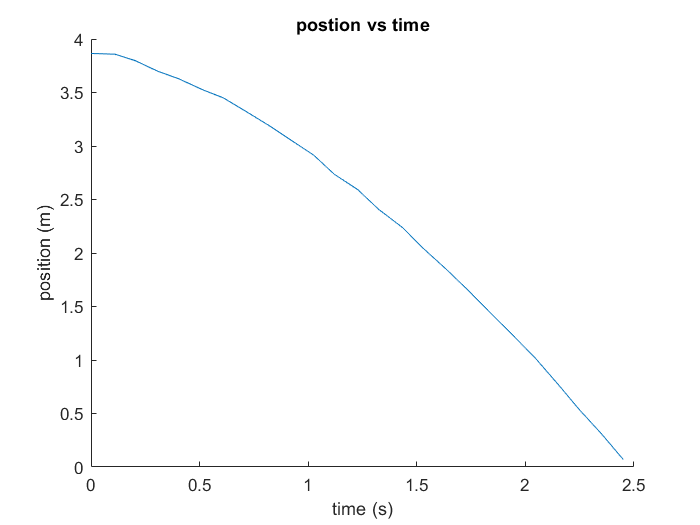
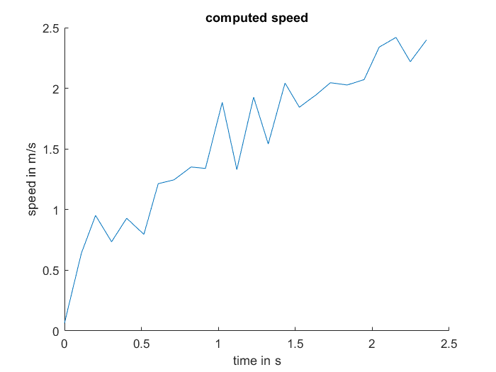
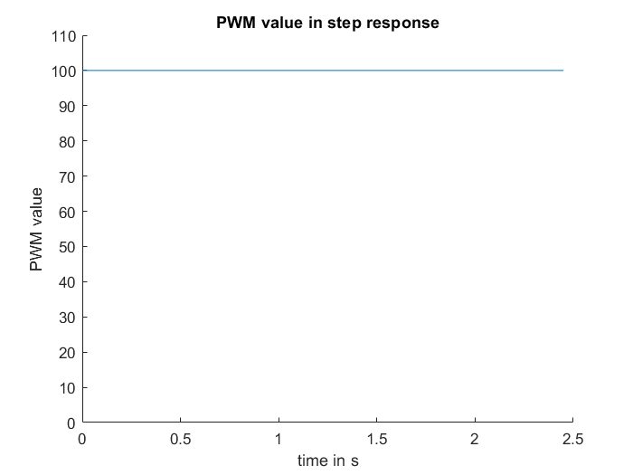
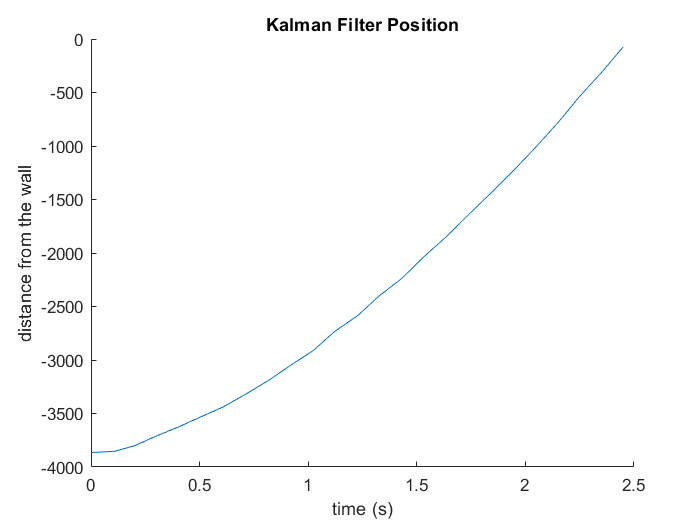
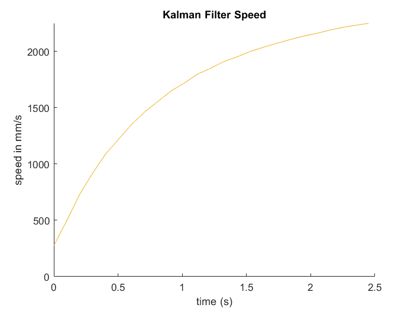
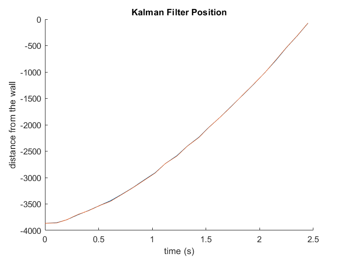
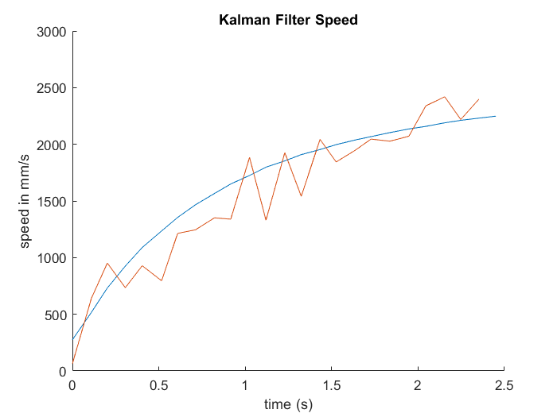
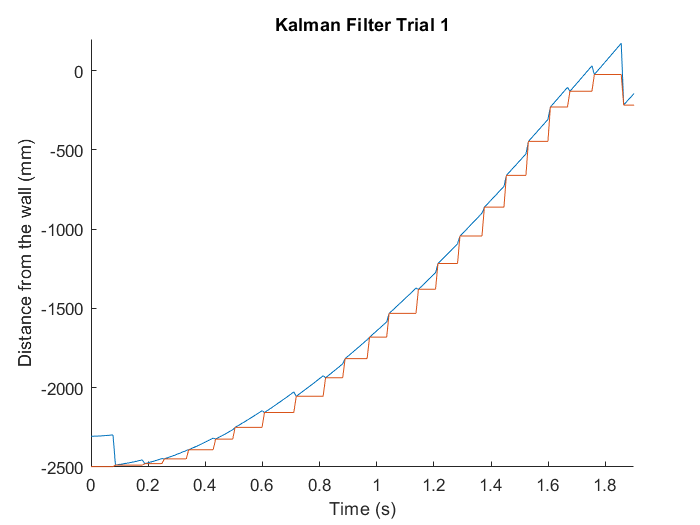
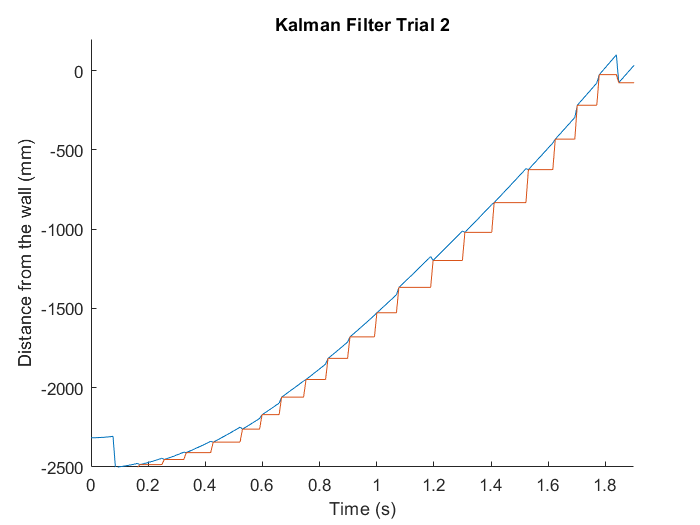
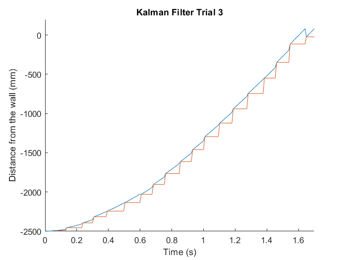

# Lab 7 - Kalman Filter
## Why a Kalman Filter?
My distance sensor is only so fast. I need something to predict what's happening in between distance sensor values. Also, nothing in life is certain, and a Kalman filter is a way to approximate uncertainty in states of the robot, in this case position and speed.

## Data Collection and Graphs
### Raw Data
In Matlab:
```
ts100 =[21146, 21256, 21348, 21452, 21550, 21662, 21755, 21858, 21968, 22062, 22171, 22266, 22375, 22470, 22579, 22672, 22781, 22874, 22983, 23093, 23191, 23300, 23393, 23498, 23596];
ts100 = ts100 - 21146; % make time start at 0
tof100 = [3865, 3858, 3799, 3700, 3628, 3524, 3450, 3325, 3188, 3061, 2915, 2736, 2591, 2408, 2240, 2050, 1849, 1668, 1445, 1222, 1019, 764, 539, 306, 71];
ts100 = ts100.*.001; % convert to seconds
tof100 = tof100.*.001; % convert to meters
```
### Position

### Speed


Speed Calculation in MatLab:
```
for i = 1:1:length(ts100)-1
   dt = ts100(i+1) - ts100(i);
   dx = tof100(i)-tof100(i+1);
   speed(i) = dx/dt;
end
```
### Step Response PWM Input


### Finding Steady State Speed & Rise Time
MatLab:
```
steadyStateSpeed = mean(speed(22:24)); % calculate a mean because the speed fluctuates at the end and I'm not sure which value to trust
ninetyprtspeed =.9*steadyStateSpeed;
interpolatedRiseTime = (1-(speed(21)-ninetyprtspeed)/(speed(21)-speed(20)))*(ts100(21)-ts100(20)) + ts100(20);
```
output:
```
steadyStateSpeed: 2.3455 m/s
ninetyprtspeed = 2.1109 m/s
interpolatedRiseTime = 1.9614 s
```
I interpolated for the rise time because I am a nerd and this increases accuracy by .02 seconds compared to rounding to the nearest data point. And since the whole point of doing this is the TOF sensor only gets values every .1 seconds, .02 seconds matters.

### Finding A & B Matrices
MatLab:
```
u = 1;
d = u/steadyStateSpeed;
m = -d*interpolatedRiseTime/log(.1);
A = [0,1;
    0,-d/m]
B = [0; 1/m]
```
I got:
```
A =

 0    1.0000

 0   -1.1739

B = 

    0

    2753.4
```
Note: to find the B matrix, convert the speed to mm/s by multiplying the value by 1000 so that the units work out with the unmodified matrix of TOF values.

## Kalman Filter Setup
### Process Noise and Sensor Noise Covariance Matrices
Process noise: sigma_1 and sigma_2, the noise/error in the dynamical model.

I found these by saying there is 10^2mm^2 of uncertainty and multiplying by 1/.1s, the frequency of my sensor values, and doing the square root of that value.

Sensor noise: sigma_3, the noise/error in the sensor readings.

I found this by saying there is 20mm of uncertainty in my sensor measurements.

```py
sigma_1 = 31.6227766017; #trust in modeled position
sigma_2 = 31.6227766017; #trust in modeled speed
sigma_3 = 20; # trust in sensor values
sig_u=np.array([[sigma_1**2,0],[0,sigma_2**2]]) //We assume uncorrelated noise, therefore a diagonal matrix works.
sig_z=np.array([[sigma_3**2]])
```

### C Matrix
My C matrix is `[-1;0]` because my state space is `[x; xdot]`, and I can only measure `x` in the negative direction. I cannot measure xdot directly with my TOF sensor.

## Sanity Check
```py
mu = np.array([[TOF[0]],[0]]) % most likely initial position is the first TOF value, most likely initial speed is 0
y = TOF[0] % intitial output is the initial TOF value
sigma = np.array([[.01,0],[0,.01]]) % initialize sigma with the initial uncertainty in position and velocity. keep these numbers low as I am relatively confident the mu values are very close to correct
u = 100/255 % the control input, in my case, 100/255
dt = 0.1 # dt is the time difference between the sensor values
```

Loop over the TOF values we know already and use them to make a best guess on the current position.

```py
for x in range(0, 25):
    y = -TOF[x]
    mu, sigma = kf(mu, sigma, u, y)
    muarray[0, x] = mu[0]
    muarray[1, x] = mu[1]
```
Running the Kalman filter, I was able to produce these graphs of the position and velocity.



Overlay with the original data:





They look nearly identical :)




And the speed is a nicely smoothed out curve of the calculated speeds, as the dynamical model can be used to find points in between :)

## Implement on Robot
The goal of this code is not necessarily to reach the target without overshoot (in fact I will not make my robot stop), but rather to show that the Kalman filter works and the distance values it finds are reasonable given the distance data colleced simultaneously via the distance sensor.

A new library has been added to the mix, the BasicLinearAlgebra library.
### Initialize Variables
```cpp
float sigma_1 = 31.6227766017; //trust in modeled position
float sigma_2 = 31.6227766017; //trust in modeled speed
float sigma_3 = 20.0; //trust in sensor values
Matrix <2,2> Sigma_u = {1000.0,0,0,1000.0}; // sigma_1^2 and sigma_2^2 * identity matrix
                          
Matrix <1,1> Sigma_z ={40.0}; //sigma_3^2

Matrix <2,2> A = {0,1,0,-1.1739};
Matrix <2,1> B = {0,7.02*1000};
Matrix <1,2> C = {-1,0};

Matrix <2,2> Ad = {1.0,0.00855,0.0,0.98996315}; //calculate new discretized values with new dt
Matrix <2,1> Bd = { 0.0,60.021};

Matrix <2,2> sigma {.01,0,0,.01};
Matrix <1,1> u = {.3922}; // 100/255; 100 is the step response PWM value I used

// initialize state vector
Matrix <2, 1> mu = {0.0,0.0};
Matrix <1,1> y = {0.0}; //these will get changed later when we find the initial distance value

Matrix <2,2> eye = {1,0,0,1};

// used during KF execution, initialize all as zeros
Matrix <2,1> mu_p = {0.0,0.0};
Matrix <2,2> sigma_p = {0.0,0.0,0.0,0.0};
Matrix <1,1> sigma_m = {0.0};
Matrix <1,1> sigma_minv = {0.0};
Matrix <2,1> kkf_gain = {0.0,0.0};
Matrix <1,1> y_m = {0.0};

Matrix <2,1> sub = {0.0, 0.0};

int initialDistance;
```

When implementing on the robot, it is necessary to change dt because the dynamical model parts of the code run much more often than we get new distance sensor values, which allow us to figure out where the robot is in between reads of the distance sensor.

I used a dt value of .00855 seconds. I found this by running my code for 500 iterations, using millis(); to get the start and end times, and divided the difference by 500.

Be sure to find new discretized matrices with this new dt value using the Python code.

### Distance Sensor Code
The code needs to be structured such that the Kalman filter is running while we wait for a new value from the distance sensor. I wrote this function, with inspiration from Anya Prabowo, to set a boolean value to show if the variable storing the distance sensor reading has been updated in the current loop iteration. This code also updates the distance sensor reading.
```cpp
void checkForDistance()
{
    if (distanceSensor1.checkForDataReady())
    {
      distance1 = distanceSensor1.getDistance(); 
      distanceSensor1.clearInterrupt();
      distanceSensor1.stopRanging();
      distance1 = -distance1;
      newdistance = true;
      distanceSensor1.startRanging();
    }
    else {
      newdistance = false;
    }
}
```

### Kalman Filter Loop Code
```cpp
void kalmanFilter(){
  // prediction step  
  mu_p = Ad*mu - Bd*u;
  sigma_p = Ad*sigma*~Ad + Sigma_u;

  checkForDistance();
  // update step
  if (newdistance == true) {
    sigma_m = C*sigma_p*~C + Sigma_z;
    sigma_minv(0,0) = sigma_m(0,0);
    Invert(sigma_minv); // this inverts the matrix sigma_minv, which started out equal to sigma_m before this line
    kkf_gain = sigma_p*~C*sigma_minv;
    y(0,0) = distance1; // make sure to include the (0,0) or things will NOT go well
    y_m = y - C*mu_p;
    sigma = (eye-kkf_gain*C)*sigma_p;
    newdistance = false;
    mu = mu_p + kkf_gain*y_m;
  }
  else{
    // make sure mu and sigma are updated with just predictions
    // if the update step is not run
    mu = mu_p;
    sigma = sigma_p;
  }
}
```

### Kalman Filter Results
The Kalman filter output is shown in blue and the distance sensor values are shown in red. It seems like there is a lot of trust in the
distance sensor values, and the dynamical model does a pretty good job of approximating what's happening in between the distance sensor values.



