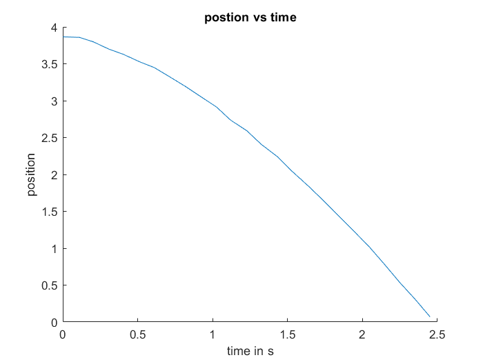

# Lab 7 - Kalman Filter

## Data Collection and Graphs
### Raw Data
In Matlab:
```
ts100 =[21146, 21256, 21348, 21452, 21550, 21662, 21755, 21858, 21968, 22062, 22171, 22266, 22375, 22470, 22579, 22672, 22781, 22874, 22983, 23093, 23191, 23300, 23393, 23498, 23596];
ts100 = ts100 - 21146; % make time start at 0
tof100 = [3865, 3858, 3799, 3700, 3628, 3524, 3450, 3325, 3188, 3061, 2915, 2736, 2591, 2408, 2240, 2050, 1849, 1668, 1445, 1222, 1019, 764, 539, 306, 71];
ts100 = ts100.*.001; % convert to seconds
tof100 = tof100.*.001; % convert to meters
```
### Position

### Speed


Speed Calculation in MatLab:
```
for i = 1:1:length(ts100)-1
   dt = ts100(i+1) - ts100(i);
   dx = tof100(i)-tof100(i+1);
   speed(i) = dx/dt;
end
```
### Step Response PWM Input


### Finding Steady State Speed & Rise Time
MatLab:
```
steadyStateSpeed = mean(speed(22:24)); % calculate a mean because the speed fluctuates at the end and I'm not sure which value to trust
ninetyprtspeed =.9*steadyStateSpeed;
interpolatedRiseTime = (1-(speed(21)-ninetyprtspeed)/(speed(21)-speed(20)))*(ts100(21)-ts100(20)) + ts100(20);
```
output:
```
steadyStateSpeed: 2.3455 m/s
ninetyprtspeed = 2.1109 m/s
interpolatedRiseTime = 1.9614 s
```
I interpolated for the rise time because I am a nerd and this increases accuracy by .02 seconds compared to rounding to the nearest data point. And since the whole point of doing this is the TOF sensor only gets values every .1 seconds, .02 seconds matters.

### Finding A & B Matrices
MatLab:
```
u = 1;
d = u/steadyStateSpeed;
m = -d*interpolatedRiseTime/log(.1);
A = [0,1;
    0,-d/m]
B = [0; 1/m]
```
I got:
```
A =

 0    1.0000

 0   -1.1739

B = 

    0

    2.7534
```

## Kalman Filter Setup

### Process Noise and Sensor Noise Covariance Matrices

### C Matrix
My C matrix is `[-1;0]` because my state space is `[x; xdot]`, and I can only measure `x` in the negative direction. I cannot measure xdot directly with my TOF sensor.

## Sanity Check

## Implement on Robot
