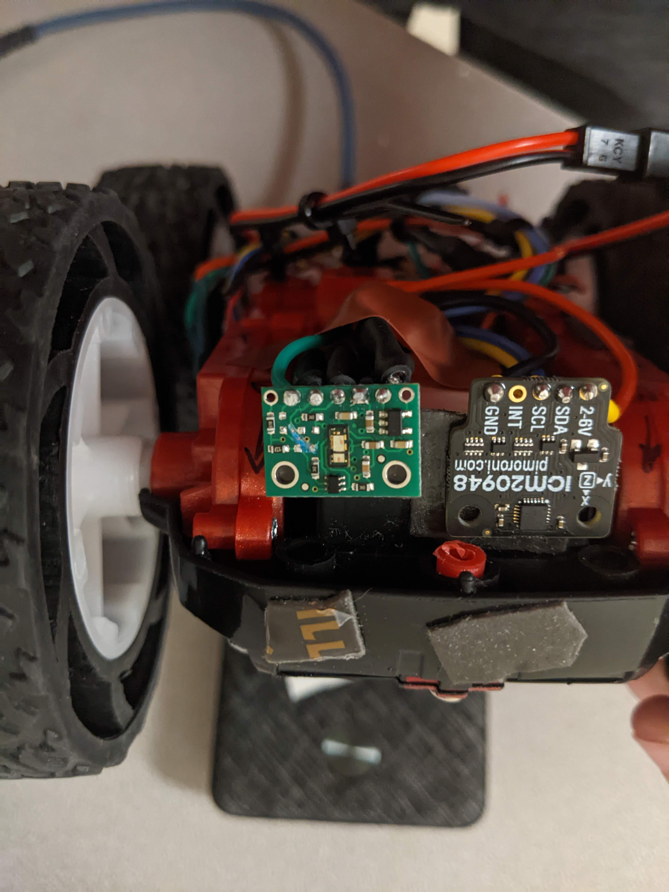
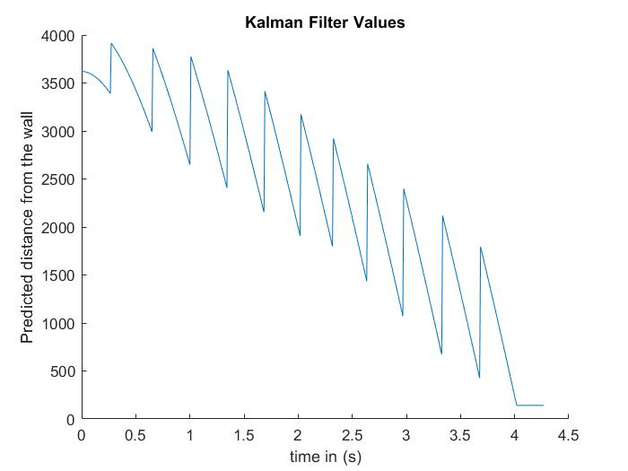
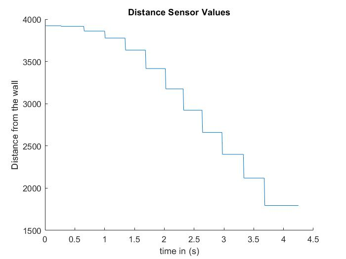
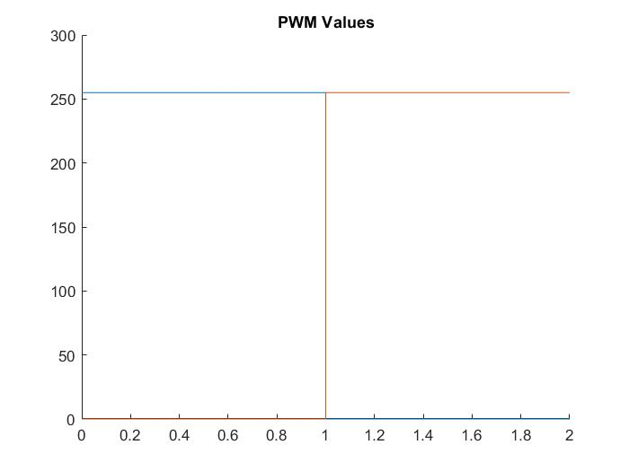

# Lab 8 - Stunts

In this lab, I will attempt to do some stunts with my robot: getting it to flip near a wall and doing some open loop shenanigans because I can.

## Task A - Flip
Due to a broken TOF sensor, I am currently unable to complete the flipping portion of this lab.



However, I have figured out that I absolutely cannot do a flip with open loop control on the tile floor outside of the sticky mat.

### Flip: Theoretically:
In theory, I believe that the following code in a control loop, combined with my Kalman Filter from the previous lab, should lead to my robot flipping and driving back the way it came.
```cpp
  if (flipped == false){
      kalmanFilter();
      analogWrite(13, 255); // move forward until the robot is close to the wall
      analogWrite(6, 255);
  }
  if (abs(mu(0,0)) < 175 && abs(mu(0,0)) > 100 && flipped == false){ // only flip "flipped" to true once, when the robot is close to the wall
    flipped = true;
  }
  if (flipped == true) {
    muflip = mu(0,0);
    analogWrite(12, 255);
    analogWrite(7, 255);
    analogWrite(13, 0); // forward
    analogWrite(6, 0);
    delay(15); // for currently unknown reasons, avoiding constantly writing new motor values seems to help my motors function correctly
  }
```

### Why the Flip is Theoretical - Some failed attempts and why they failed
I have yet to actually acheive a flip with my robot. 

Several things have happenned instead of the robot flipping.

First, one of the things that has happened when I tried to complete the stunt, my robot consistently turns instead of flipping. I think this is because of differing motor dynamics between the two motors on my robot. I believe that the motor on the right is switching direction much more quickly than the motor on the left, which is causing the robot to turn rather than flip. Here is a video of this scenario: [link](https://photos.app.goo.gl/cYdUd3oKfU1bagFC6)

Second, I have also caused the robot to both flip and turn, and then no longer move. This flip also had some rotation in the same direction as the previous video, which shows that the right motor is consistently switching direction faster than the left. I believe that the reason the robot stopped moving is the forces from the flip caused a loose wire to be disconnected, which turned the robot off. Here's a [video](https://photos.app.goo.gl/iDkSEkSc6oeF5tuaA) of this attempt.

Lastly, I have a video of a third attempt where the motor dynamics cause the robot to stop and turn at the same time, again showing that the right motor changes speed much faster than the left. [video](https://photos.app.goo.gl/3DxHJCs13oG2afMi9)

I believe if I had an opportunity to try this on another robot with motors that are more similar, I would be much more likely to have success.The muflip value is always a reasonable distance from the wall, and always just within the threshold for flipping the motor values. The motor values clearly do change since the robot changes its direction without any outside forces touching it.

I also have noticed from graphing my Kalman filter that my dynamics model might be a bit off. The graph of the Kalman filter jumps up a lot each time I get a new sensor value, so I think I would need to try again to adjust my A & B matrices (that represent the dynamics) to get a better idea of where the robot is.

I think this happened because when I got the data to create the model, I used a PWM input of 100 and here I used a PWM input of 255. I assumed that the speed relationship between these two values was linear, however, in reality it is not. This caused my dynamics model to be inconsistent with the control input (u), and therefore my Kalman filter no longer does the best job of modelling the robot's location.

### Graphs
#### Kalman Filter Values
Note that I stop running the Kalman filter after the robot "flips" so that I do not get any confusing values when the distance sensor is no longer pointing towards the wall.



#### Sensor Values
I believe the sensor values stopped at such a high value due to errors in Bluetooth transmission.



#### PWM Input
The PWM signal is high before the Kalman filter reaches the threshold, and high in the opposite direction after the threashold is reached.


## Open Loop Stunt
[video 1](https://photos.app.goo.gl/m6nehSgzofdabECC9)
[video 2](https://photos.app.goo.gl/dF26o3prUiyg4TmT7)
[video 3](https://photos.app.goo.gl/EoGe5DcBscHbzFTU8)
Despite all the drifting and turns, the robot ends up in approximately the same spot each time.

## Blooper Videos
[it flips!!](https://photos.app.goo.gl/GfRHqqUpcPGycWCg7)


[life on the edge](https://photos.app.goo.gl/MQZ21gRPkQjnVQ5D8)