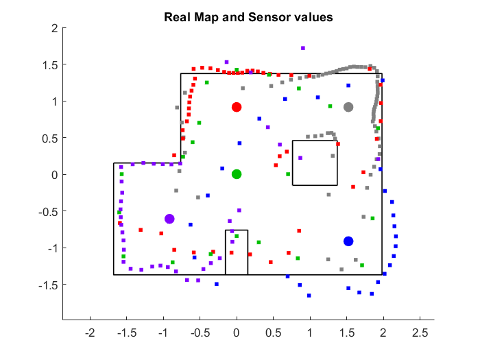

# Lab 9 - Mapping
#### Shout-outs - Help Received
I talked to Priyam a bit about his approach to the lab and how to collect data, and I got the idea of using open loop control for this lab from him.

### Some Opinions on Taping Wheels
I attempted to put tape over the wheels of my car, like many others have, to help the car spin on axis with less friction. Tape is really great to get the car to *start* spinning. However, slippery tape on the wheels is not so useful when I want my car to *stop* spinning.

This lab has a nearly equal need for the robot to start and stop spinning in a consistent way to ensure accurate measurements.

Therefore, my wheels do not have tape on them.

They do, however, have the sticky remnants of some tape, which I believe is the ideal situation.

### Some Bad Data
Here is a not great run of trying to get a map at location 5,3. Yikes!


This was a first attempt, but shows that I do not need so many data points. The robot went over one rotation and was also likely going much faster than I needed it to, since I was spinning it at full power.

### Open Loop Control
While the instructions for this lab claim that PID control is superior, in this situation, I disagree. The goal is for the robot to move in a way such that its end locations can be accurately measured. It does not matter so much if the measurement is taken at, say, 20 degrees or 21 degrees as long as we are reasonably confident in the sensor value. (ahahaha why would my sensor ever be wrong... not in this lab :woozy_face:)

Anyway, PID control is a lot of work to implement properly. Doing so does not exactly lead to better data. So, I used open loop control for this lab.

### My Gyroscope Drifts Inconsistently - More reasons for Open Loop Control
I also found in using my gyroscope that it drifts a lot and it drifts in an inconsistent manner. PID control would require using the gyroscope to tell my robot how far it is from the setpoint, and I wouldn't be able to get useful data on that due to the nonlinear drift that occurs on my gyroscope.

This inconsistent drifting is a major reason I didn't even use my gyroscope readings in my data processing. Despite my best efforts to use a low-pass filter on the measurements, the gyroscope drifted by a different amount in every test. Therefore, I decided it would be best to watch my robot turn, and to stop the turns when it reached 360 degrees, then assume the measurements were equally spaced, as it was running the same control loop each iteration anyway.

### Odd Bluetooth Stuff
I discovered that my robot may have undefined behavior when it loses connection from my computer. That was fun. :upside_down:

### Spin Control Loop Code
```cpp
  if (n == -1){ // first iteration setup stuff
    n = 0;
    lasttime = millis();
    timedt = millis();
    readDistance();
    getAngle();
    distances[n] = distance1;
    angles[n] = pitchlpf;
  }
  if (millis() < lasttime + 250) { //turn on the motors once at the start, then keep going until 250 ms has passed
    if (first == true){
      analogWrite(13, 150);
    analogWrite(7, 150);
    analogWrite(12, 0);
    analogWrite(6, 0);
    first = false;
    }
  }
  else {
    analogWrite(13, 255); // time to collect data and store
    analogWrite(7, 255);
    analogWrite(12, 255);
    analogWrite(6, 255);
    delay(30);
    readDistance();
    getAngle();
    distances[n] = distance1;
    angles[n] = pitchlpf;
    n = n + 1;
    lasttime = millis();
    first = true;
  }
```

Get Angle function:
```cpp
void getAngle(){
    if (myICM.dataReady())
  {
    dt = millis() - timedt;
    myICM.getAGMT();
    gypitch = gypitch-myICM.gyrX()*dt/1000; // integration
    timedt = millis();
    float alpha = .05;
    if(m > 1){
      pitchlpf = alpha*gypitch + (1-alpha)*lastpitch; //low pass filter
      lastpitch = gypitch;
    }
    else {
      pitchlpf = 0;
      lastpitch = 0;
      m = 2;
    }
  }
}
```

### A better Polar Plot at 5,3


After *many* iterations and variations of my control loop, and tweaks to the power to the motors, Bluetooth setup, timing of things, et cetera, I started getting data that looked more like the above.

### Converting to Cartesian
```m
distt = distt.*-1/1000;
for i = 1:70
    x53(i) = distt(i)*cosd(-i/70*360)+1.524;
    y53(i) = distt(i)*sind(-i/70*360)+0.9144;
end
```
Above is one example of how I converted my data points to cartesian coordinates, assuming equal spacing of measurements.

This could have been done with a rotation matrix, but that would have been more confusing than it would have been worth. Adding the 1.524 and 0.9144 is a coordinate shift as the data points in this list were taken at that location. This could also be represented in matrix form as an additive shift, but I found that doing so was not needed to quickly plot my data.

### Real Map and Data Points

After some transformations and post-processing, here's the map I was able to achieve. It seems that I would see some improvement in re-doing the scans and attempting to refine my control loop just a bit more, I might have better luck in the areas that aren't depicted too well.


### Hand-Drawn Map from data points
Here's my best approximation of a map from the data I got.


